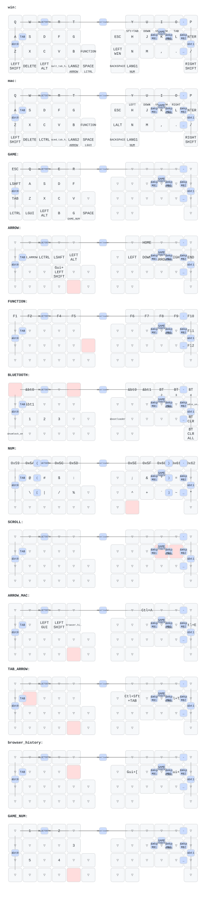
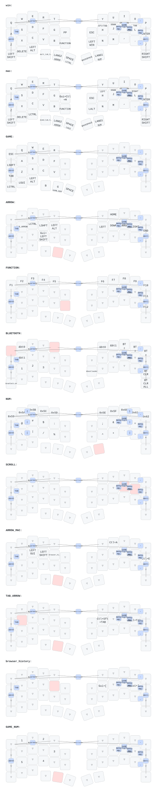

# moNa2 / microball ZMK firmware

moNa2とmicroballのZMKファームウェア、キーマップ、3Dモデルを管理するリポジトリです。
2台のキーボードは、それぞれ独立したZMKワークスペースとキーマップを使用します。

[](https://github.com/e-komiya/moNa2-zmk/actions/workflows/build.yml)
[](https://github.com/e-komiya/moNa2-zmk/actions/workflows/draw.yml)

## moNa2 keymap



キーマップの定義は [`config/mona2.keymap`](config/mona2.keymap) です。

## microball keymap



キーマップの定義は [`config/microball.keymap`](config/microball.keymap) です。

## Managed keyboards

| Keyboard | Keymap | ZMK environment | Main side |
| --- | --- | --- | --- |
| moNa2 | `config/mona2.keymap` | `config/west.yml` | Right |
| microball | `config/microball.keymap` | `keyboards/microball/config/west.yml` | Right |

moNa2は現在の構成を使用し、microballは互換性のためZMK v0.2と専用の
エンコーダスクロール実装を維持しています。一方のキーマップを変更しても、もう一方には反映されません。

## Firmware builds

[`Build keyboards`](https://github.com/e-komiya/moNa2-zmk/actions/workflows/build.yml) workflowは、
push、pull request、手動実行で次のUF2を生成します。

| UF2 | Target |
| --- | --- |
| `mona2-right.uf2` | moNa2右側、メイン側 |
| `mona2-left.uf2` | moNa2左側 |
| `mona2-right-diagnostic.uf2` | moNa2右側の診断用 |
| `microball-right.uf2` | microball右側、メイン側 |
| `microball-left.uf2` | microball左側 |
| `settings-reset.uf2` | 保存設定の消去用 |

完了したrunのArtifactsから `firmware` をダウンロードすると、6個のUF2をまとめて取得できます。
通常更新では、使用するキーボードと左右が一致するUF2を書き込んでください。
`settings-reset.uf2` はBluetoothを含む保存設定を消去する復旧用で、通常の更新には使用しません。

## Bluetooth and DYA Studio

moNa2とmicroballは通常のBluetoothキーボード接続に対応しています。両方とも右側がメイン側です。

- `Q` + `T`を押しながら `/`: 現在のBluetoothプロファイルを消去
- `Q` + `T`を押しながら右Shift: 全Bluetoothプロファイルを消去

プロファイルを消去した場合は、PCやスマートフォン側でも登録済みデバイスを削除してから再ペアリングします。

通常版の右側ファームウェアには、DYA Studio用のZMK Studio USB UART snippetが含まれています。
DYA Studioで設定するときは右側をUSB接続してください。Bluetoothは通常のキー入力に使用でき、
Studioとの設定通信はUSB経由です。

## moNa2 pointing configuration

moNa2右側では、元のbadjeff版PMW3610ドライバを使用しています。125 Hz相当となるよう、最小レポート間隔を8 msに設定し、Bluetooth peripheral intervalを次の値に固定しています。

```conf
CONFIG_PMW3610_REPORT_INTERVAL_MIN=8
CONFIG_BT_PERIPHERAL_PREF_MIN_INT=6
CONFIG_BT_PERIPHERAL_PREF_MAX_INT=12
```

COROPITでの向きに合わせ、デバイスツリーでX軸とY軸を反転しています。

## moNa2 rotary encoder

moNa2左側のEC11ロータリーエンコーダをD5/D0で有効にしています。
回転操作は通常のWindowsレイヤーでは上下スクロール、macOSレイヤーでは左右スクロール、
矢印レイヤーでは音量調整として動作します。エンコーダの種類に合わせた
`steps = <24>`と`triggers-per-rotation = <10>`を使用しています。

## Keymap drawings

[`Draw ZMK Keymap`](https://github.com/e-komiya/moNa2-zmk/actions/workflows/draw.yml) workflowは、
`config/*.keymap`、対応するJSON、描画設定が変更されたときにキーマップ図を生成します。
生成したSVGとYAMLはActionsの `drawings` artifactに保存し、`keymap-drawer/`にも自動コミットします。
このREADMEは生成済みの [`mona2.svg`](keymap-drawer/mona2.svg) と
[`microball.svg`](keymap-drawer/microball.svg) を表示します。

## Model files

- `model/`: 印刷用に編集した3MF/STLと派生モデル
- `model/original/`: `sayu-hub/zmk-config-moNa2`から取得した未変更の元データ
- `model/original/README.md`: 元データの取得元とコミット

同名でも内容が異なるモデルがあるため、編集版と元データは別ディレクトリで管理します。
